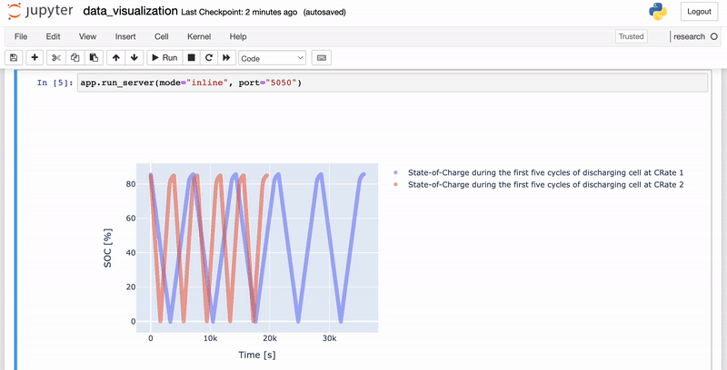

# Battery-SoC-Estimation 🔋

This repository contains the data and code for the paper [Estimating Battery State-of-Charge within 1% using Machine Learning and Physics-based Models (SAE'23)](https://www.sae.org/publications/technical-papers/content/2023-01-0522/). Specifically, here we included LiPo 5450 mAh cell dataset, Python framework for building neural network model that predicts battery SoC, and the best hyperparameters we found during hyperparameter tuning.

<p align="center">
  <a href="#data">Data 🗃️</a> •
  <a href="#installation">Installation 🛠️</a> •
  <a href="#quick-start">Quick Start 🚀</a> •
  <a href="#hyperparameter-tuning">Hyperparameter Tuning ⚙️</a> •
  <a href="#contributing">Contributing 🐜</a> •
  <a href="#license">License ⚖️</a>
</p>

## Data
The [LiPo 5450 mAh cell](https://maxamps.com/products/lipo-5450-1s-3-7v-battery) data can be found in <em>data</em> directory 👀. We collected 48 discharging-charging cycles for CRates 1, 2, 3, and 4. The measurements were recorded at 1 second rate. To understand data better, we provided a [Jupyter](https://jupyter.org/) notebook <em>data_visualization.ipynb</em> in <em>notebooks</em> directory. We used [Jupyter Dash](https://github.com/plotly/jupyter-dash) library which allows to create interactive plots.

<div align="center">



</div>

## Installation

> __Note__
> We used Python 3.8 and versions of dependencies specified in <em>requirements.txt</em>, but it is not necessary to follow exactly the same versions.

Create [Python virtual environment](https://docs.python.org/3/library/venv.html):

```console
python3.8 -m venv battery-soc-estimation-venv
source  battery-soc-estimation-venv/bin/activate
```

[Fork the repo](https://docs.github.com/en/get-started/quickstart/fork-a-repo) and clone forked repo:

```console
git clone https://github.com/your_github_username/Battery-SoC-Estimation
```

Install dependencies:

```console
cd Battery-SoC-Estimation
pip3 install -r requirements.txt
```

## Quick Start
> __Note__
> The best hyperparameters we found are included in <em>.ini</em> config files.

<strong>First of all, run data processing</strong>. This step creates training, validation, and test datasets. Besides that, it can add new features which are formed by applying filter to one of the existing features. In order to run data processing, you must specify the name of the <em>data processing configuration (dpc)</em> file which should be located in <em>src/data_processing/configs</em>:

```console
# Run any one of the examples

# Example 1
python3 main.py -r=data_processing -dpc=I_V_T.ini

# Example 2
python3 main.py -r=data_processing -dpc=I_V_T_Vma.ini

# Example 3
python3 main.py -r=data_processing -dpc=I_V_T_Ih_Vh_Th.ini

# Example 4
python3 main.py -r=data_processing -dpc=I_V_T_Ibwf.ini
```

<details><summary>Click here to learn more about dpc</summary>
<p>

You can specify any other data processing configuration file or create your own. Each configuration file should contain the following:
<div align="center">

| Property  | Value | Example
| ------------- | :-------------: | -------------: |
| train_cycles  | Range of cycle numbers to be included in training dataset from each CRate (border values incl.) | [1, 30] |
| val_cycles  | Range of cycle numbers to be included in validation dataset from each CRate (border values incl.) | [31, 38]  |
| test_cycles  | Range of cycle numbers to be included in test dataset from each CRate (border values incl.) | [39, 48] |
| features  | Which features will be fed as input to the ML model | ['Voltage [V]', 'Current [A]', 'TempBottom [C]', 'Current_MA [A]', 'TempBottom_BWF [C]', 'Voltage_H [V'] |
| ma_window_size | If you included in <em>features</em> a feature modified with Moving Average filter, then you need to specify the window size of the filter | {'Current_MA [A]': 20} |
| bwf_cutoff_fs | If you included in <em>features</em> a feature modified with Butterworth filter, then you need to specify the cutoff frequency of the filter | {'TempBottom_BWF [C]': 0.0001} |
| bwf_order | If you included in <em>features</em> a feature modified with Butterworth filter, then you need to specify the order of the filter | {'TempBottom_BWF [C]': 1} |
| h_window_size | If you included in <em>features</em> a feature modified with Hampel filter, then you need to specify the window size of the filter | {'Voltage_H [V]': 1} |
| h_n | If you included in <em>features</em> a feature modified with Hampel filter, then you need to specify the threshold n of the filter | {'Voltage_H [V]': 3} |

</div>

</p>
</details>

Processed data is saved in <em>src/data_processing/processed_data</em>. If the dpc name was <em>anyname.ini</em>, then there are created three of the following files - <em>anyname_train.csv</em>, <em>anyname_val.csv</em>, and <em>anyname_test.csv</em>.

_ _ _

<strong>Second, run model training</strong>.  The command takes for input the name of a data processing configuration file, and the name of a <em>model training configuration (mtc)</em> file which can be found in  <em>src/model_training/configs</em>:

```console
# Run any one of the examples

# Example 1
python3 main.py -r=model_training -dpc=I_V_T.ini -mtc=I_V_T.ini

# Example 2
python3 main.py -r=model_training -dpc=I_V_T_Vma.ini -mtc=I_V_T_Vma.ini

# Example 3
python3 main.py -r=model_training -dpc=I_V_T_Ih_Vh_Th.ini -mtc=I_V_T_Ih_Vh_Th.ini

# Example 4
python3 main.py -r=model_training -dpc=I_V_T_Ibwf.ini -mtc=I_V_T_Ibwf.ini
```

<details><summary>Click here to learn more about mtc</summary>
<p>

You can specify any other model training configuration file or create your own. Each configuration file should contain the following:
<div align="center">

| Property  | Value | Example
| ------------- | :-------------: | -------------: |
| num_hidden_layers  | Number of hidden layers in neural network | 2 |
| units_hidden_layers  | Number of units in each hidden layer | [80, 80] |
| activations_hidden_layers  | Activations of each hidden layer | ["tanh", "leaky_relu"] |
| activation_response_layer  | Activation of response layer | "clipped_relu" |
| epochs  | Number of epochs | 30 |
| batch_size  | Batch size | 64 |
| learning_rate  | Learning rate | 0.003311 |

</div>

</p>
</details>

Trained model is saved in <em>src/model_training/trained_models</em>. If the dpc name is <em>anyname1.ini</em> and mtc name were <em>anyname2.ini</em>, then the name of the saved model is <em>anyname1_anyname2</em>.

_ _ _

<strong>Third, run model inference</strong>. The command takes for input dpc and mtc. There is NO inference configuration file. Running this command simply makes predictions on a test dataset:

```console
# Run any one of the examples

# Example 1
python3 main.py -r=inference -dpc=I_V_T.ini -mtc=I_V_T.ini

# Example 2
python3 main.py -r=inference -dpc=I_V_T_Vma.ini -mtc=I_V_T_Vma.ini

# Example 3
python3 main.py -r=inference -dpc=I_V_T_Ih_Vh_Th.ini -mtc=I_V_T_Ih_Vh_Th.ini

# Example 4
python3 main.py -r=inference -dpc=I_V_T_Ibwf.ini -mtc=I_V_T_Ibwf.ini
```

Test dataset with the model predictions is saved in <em>src/inference/results</em>. If the dpc name was <em>anyname1.ini</em> and mtc name was <em>anyname2.ini</em>, then the name of saved results is <em>anyname1_anyname2.csv</em>. To analyze the results we included Jupyter notebook <em>results_visualization.ipynb</em>.

## Hyperparameter Tuning

> __Note__
> Hyperparameter tuning is a long-running process that takes hours so we included some of the best hyperparameter configurations we found. <strong>You can skip this section if the model you trained in <em>Quick Start</em> satisfies your requirements.</strong> Otherwise, follow instructions in this section on how to run tuning and find good neural network architectures.

<strong>Set up wandb</strong>. Follow instructions [here](https://docs.wandb.ai/quickstart) on how to set up Weights & Biases account.

<strong>Run data processing and then hyperparameter tuning</strong>. 

```console
# Run any one of the examples

# Example 1
python3 main.py -r=data_processing -dpc=I_V_T.ini
python3 main.py -r hyperparameter_tuning -dpc=I_V_T.ini -mtc=I_V_T.ini -htc=config.ini -wu=your_wandb_username

# Example 2
python3 main.py -r=data_processing -dpc=I_V_T_Vma.ini
python3 main.py -r hyperparameter_tuning -dpc=I_V_T_Vma.ini -mtc=I_V_T_Vma.ini -htc=config_ma.ini -wu=your_wandb_username

# Example 3
python3 main.py -r=data_processing -dpc=I_V_T_Ih_Vh_Th.ini
python3 main.py -r hyperparameter_tuning -dpc=I_V_T_Ih_Vh_Th.ini -mtc=I_V_T_Ih_Vh_Th.ini -htc=config_h.ini -wu=your_wandb_username

# Example 4
python3 main.py -r=data_processing -dpc=I_V_T_Ibwf.ini
python3 main.py -r hyperparameter_tuning -dpc=I_V_T_Ibwf.ini -mtc=I_V_T_Ibwf.ini -htc=config_bwf.ini -wu=your_wandb_username
```

<details><summary>Click here to learn more about htc</summary>
<p>

You can specify any other hyperparameter tuning configuration file or create your own. Each configuration file should contain the following:
<div align="center">

| Property  | Value | Example
| ------------- | :-------------: | -------------: |
| tuning_count  | The amount of different hyperparameter tuning configurations to try | 200 |
| tuning_algo | Tuning algorithm | "bayes"  |
| batch_size  | Possible values of batch size for tuning to iterate through | [64, 128] |
| learning_rate  | The range of learning rate for tuning to iterate through | {"min": 0.0001, "max": 0.01} |
| units_hidden_layer  | Possible values of number of units in a hidden layer for tuning to iterate through | [40, 50, 60, 70, 80] |
| activations | Possible values of activation functions for tuning to iterate through | ["clipped_relu", "leaky_relu", "relu", "tanh", "softmax", "sigmoid"] |
| ma_window_size | If you included a feature modified with Moving Average filter, then you need to specify possible values of window size for tuning to iterate through | [10, 30, 60, 150, 300] |
| h_window_size | If you included a feature modified with Hampel filter, then you need to specify possible values of window size for tuning to iterate through | [4, 6, 8, 10, 12] |
| h_n | If you included a feature modified with Hampel filter, then you need to specify possible values of n for tuning to iterate through | [1, 2, 3, 4] |
| bwf_cutoff_fs | If you included a feature modified with Butterworth filter, then you need to specify possible values of cutoff frequency for tuning to iterate through | [0.1, 0.01, 0.001, 0.0001] |
| bwf_order | If you included a feature modified with Butterworth filter, then you need to specify possible values of order for tuning to iterate through | [1, 2, 3, 4] |

</div>

</p>
</details>

<details><summary>Click here to learn more about how hyperparameter tuning works</summary>
<p>

Hyperparameter tuning roughly follows these steps: a) take training and validation data, b) apply all possible filter configurations, and c) start wandb tuning agent. What is step b doing? If htc contains information about filters, then that means hyperparameter tuning will be traversing also through possible values of filters' parameters (ex. in case of moving average filter such parameter is window size). It takes long time to apply some filters (especially Hampel) so it is easier to apply all of them beforehand, rather than reapplying often times the same filter on the fly during tuning. To summarize, if you specify that moving average window size could be 10, 30, or 60, and there is one feature which uses that filter - 'Voltage_MA [V]', then step b will add to the data three more filtered features 'Voltage_MA [V]_10', 'Voltage_MA [V]_30', 'Voltage_MA [V]_60'. During the tuning only one of those features will be used, which one depends on the value of moving average window size that tuning is traversing through at the moment. What is step c doing? It comes up with hyperparameter configurations, trains the model, and tests the model on validation dataset.

</p>
</details>

## Contributing

Feel free to start a [discussion](https://github.com/uw-mad-dash/Battery-SoC-Estimation/discussions), or create a [pull request](https://github.com/uw-mad-dash/Battery-SoC-Estimation/pulls).

## License

[Apache License 2.0](https://choosealicense.com/licenses/apache-2.0/)

Authors: Harsh Darshan Sapra, Olesia Elfimova, Sahana Upadhya, Lukas Desorcy, Michael Wagner, Shivaram Venkataraman, Chol-Bum Kweon, Sage Kokjohn, Justin Shumaker

Affiliated: University of Wisconsin-Madison, US DEVCOM Army Research Laboratory